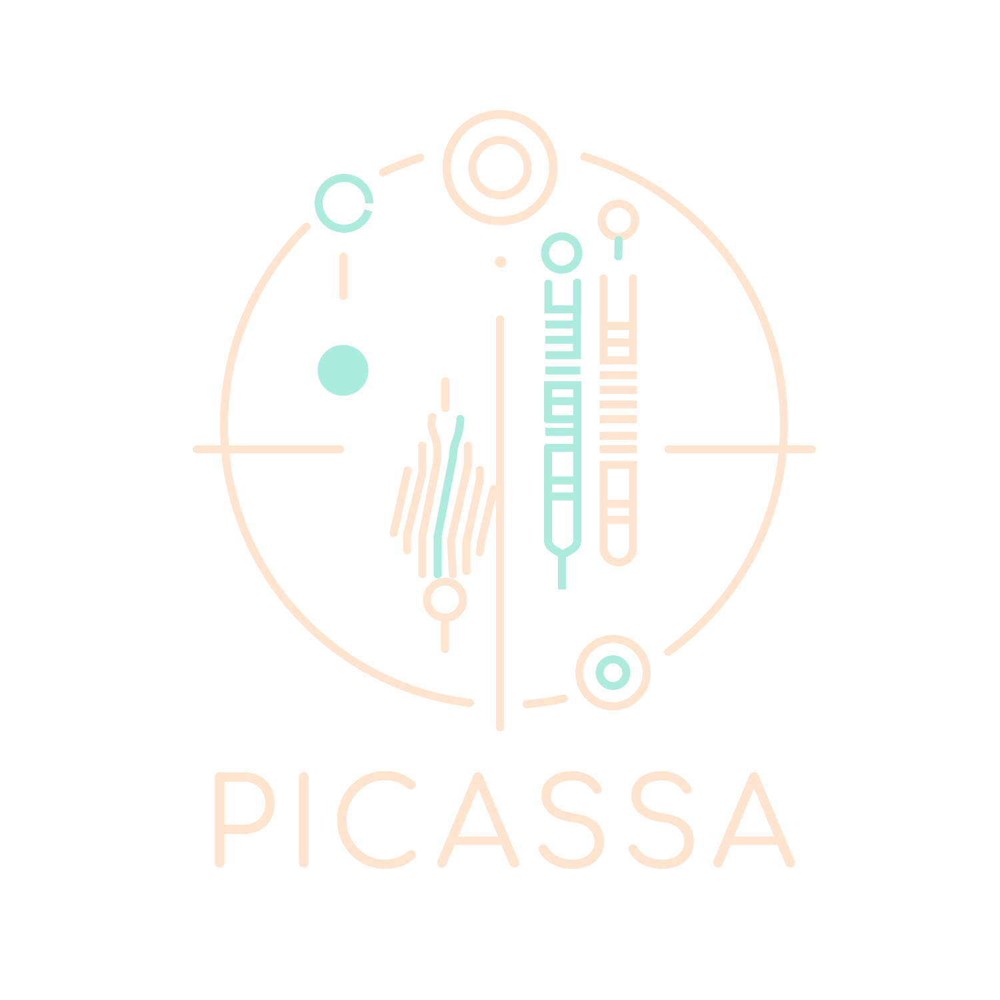

  

  <b>Platform for Interactive, Comprehensive, and Accessible scRNA-seq Analysis</b>

  <a href="http://141.76.56.146:8903/">
    🏠 Main page
  </a>
  &nbsp;&nbsp;|&nbsp;&nbsp;
  <a href="https://youtu.be/rDUwnNYnTO8">
    ▶️ Video Overview
  </a>
  &nbsp;&nbsp;|&nbsp;&nbsp;
  <a href="https://github.com/danaeynk0208/PICASSA/issues">
    🐞 Report Bug
  </a>
  &nbsp;&nbsp;|&nbsp;&nbsp;
  <a href="https://github.com/danaeynk0208/PICASSA/issues">
    💡 Request Feature
  </a>

## 📖 About PICASSA

PICASSA is a web-based platform designed for interactive, comprehensive, and accessible single-cell RNA-seq analysis. Built in R using the Seurat framework and deployed through a Shiny interface, PICASSA integrates best-practice methodologies into a structured yet flexible analytical environment.

The platform is designed to reduce technical barriers while maintaining analytical rigor, enabling both computational and non-computational users to perform advanced single-cell analyses.

### ⚙️ Platform structure

PICASSA is organized into two main analytical phases:

🔹 Phase 1 — Preprocessing & Clustering

A guided, sequential workflow to generate a high-quality, reproducible dataset structure, including:

- Data input and preprocessing  
- Quality control and filtering (cells & genes)  
- Normalization and regression  
- Dimensionality reduction (PCA, UMAP)  
- Clustering and parameter optimization  
- Automated report generation  

👉 Outcome: A robust clustering framework ready for downstream analysis

🔹 Phase 2 — Downstream & Exploratory Analysis

A flexible and modular environment for in-depth biological exploration, including:

- Differential expression analysis  
- Cluster annotation and projection  
- Trajectory inference (Monocle3)  
- Cell–cell communication analysis (LIANA)  
- Gene and genesets expression visualization  
- Functional enrichment analysis  
- Interactive re-clustering and refinement  

👉 Outcome: Iterative, hypothesis-driven exploration within a unified interface

## 🧩 Companion tools

PICASSA includes supplementary companion tools to extend functionality:

### 🔹 Gene conversion
Supports input standardization and cross-species analysis in Phase 2:
- Human ↔ Mouse gene mapping  
- Ensembl ID conversion  
- Ortholog detection
- [Live Link — ADD HERE] 

### 🔹 Pathway plotter
Facilitates visualization of enrichment results generated in Phase 2:
- Visualize enrichment analysis outputs  
- Generate publication-ready plots  
- Reuse saved analysis results without recomputation
- [Live Link — ADD HERE]

## 📚 Documentation

For full details and advanced usage:

- 🎬 Video Overview:  
[Watch here](https://youtu.be/rDUwnNYnTO8)

- 📘 Quick Manual (short & interactive):  
[Live Link — ADD HERE]

- 📄 Detailed Manual (PDF):  
[Click here](https://github.com/picassasupport-code/PICASSA/blob/main/Detailed_manual/PICASSA_Detailed_Manual.pdf)

## 🛠 Built With
R and RShiny

## 🌐 Accessibility

PICASSA is available via:

👉 [Live Application Link — ADD HERE]

## 🤝 Contributing

We welcome feedback and suggestions to improve PICASSA.

If you would like to contribute:

- Click **"Request Feature"** above to suggest new functionality  
- Click **"Report Bug"** to report any issues  

Alternatively, you can open an issue directly in the repository.

## 📑 Citation

If you use PICASSA in your research, please cite:

[ADD YOUR PAPER / THESIS / PREPRINT HERE]

## 📬 Contact

PICASSA support team
📧 picassa.support@gmail.com

## 🙏 Acknowledgments

PICASSA builds upon the functionality of several outstanding tools and resources such as:
- Seurat
- Monocle3
- LIANA
- clusterProfiler
- ggplot2 ecosystem

Special thanks to collaborators, contributors, and the scientific community supporting open-source bioinformatics tools.
